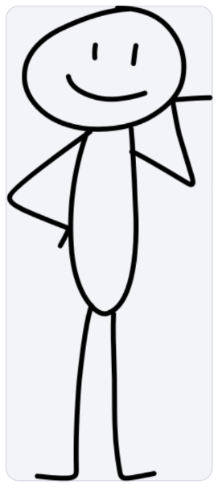

# Trip Talk — 視覚シーン練習 / 紙芝居方針

[引き継ぎの入口へ戻る](README.md)

更新日：2026-09-25

## 現在の状態：当面凍結

2026-09-25時点で、視覚シーン／絵コンテ／画像制作は**当面凍結**する。

理由：

- 素材準備の時間が実際の英語学習時間を圧迫し始めた
- Trip Talkの中心は台本の反復と実戦利用であり、視覚素材制作そのものではない
- 現時点では台本追加・既習表現の再利用・Core 1000の設計原則を優先する

ユーザーが明示的に再開を決めるまで、新しい絵コンテ、画像生成、visual metadata設計、紙芝居機能の追加実装を進めない。

以下の内容は再開時の設計資料として保持する。

## 目的と最新方針

場面の絵と人物の吹き出しを見て、英語を想起して発話する紙芝居を作る。毎発話に完成画像を1枚ずつ新規制作する方式ではない。

**同じ場所・同じ相手との会話は場面の土台を共有し、セリフと必要な小物を切り替える。場所が変わるときだけでなく、会話相手が変わったときも場面転換する。**

ホテル入口のベルスタッフとフロントの受付スタッフなど、まず少数の場面で成立させる。台本全体の画像を先に大量制作しない。

これは最新の設計方針であり、以下の機能がアプリに実装・検証済みであることを示すものではない。

## 過去の指示との関係

以下の指示は撤回・更新する。

- 顔を消す、胴体を縦線にする、人物を極端に簡略化する → 参考画像のデザインを保つ
- offer / receive / confirmのアニメーションを維持する → 静止状態の切り替えにする
- セリフは画面下の固定表示、吹き出しは将来対応 → 人物に対応した吹き出しを基本にする
- 発話ごとに完成画像を作る → 場面の土台と小物を再利用する
- 場所だけで場面を区切る → 場所または会話相手の変更で場面を転換する
- offerの静止画1枚を作って止める → 画像の見た目は承認済み。次は吹き出し・小物・相手交代を含む短い紙芝居を検証する

## 場面の構成

| 要素 | 役割 | 切り替え条件 |
|---|---|---|
| 背景・人物 | 場面の土台。背景と人物が一体の画像でもよい | 場所または会話相手が変わったとき |
| 吹き出し | 話者とセリフを結びつける。アプリで枠と文字を描く | 会話が進んだとき |
| 小物 | パスポート・鍵・カード・荷物など、会話の状況を示す | 会話に応じて表示・非表示・位置を切り替える |
| 必要なポーズ差分 | 手渡しなど、土台の姿勢では意味が伝わらない場合だけ使う | 明示された演出状態が変わったとき |

同じホテル内でも、ベルスタッフから受付スタッフへ交代したら別の場面として扱う。場面の土台は場所と会話相手の組み合わせで定義する。

移動アニメーション、ループ、自動コマ送りは使わない。操作に合わせて静止状態を即時に切り替える。

人物と小物は自然に配置し、胴体を突き抜ける輪郭や、会話に合わない持ち方を避ける。後から出し入れする小物は場面の土台に焼き込まず、透明背景の素材などで分ける。不要なポーズ差分や汎用アニメーション機構を先に作らない。

## 標準キャラクター参考画像

この画像の顔、頭と胴体の形・比率、手足の表現、線の太さや雰囲気を基準にする。顔を消したり、独自のキャラクターへ作り替えたりしない。

**固定するのはデザインであり、ポーズや向きではない。** 体・顔の向き、視線、腕や手の位置は、場面の会話と相手・小物との関係に合わせる。

素材制作時は必ず参考画像を実際に開く。確認できなければ文章から推測して描かず、報告する。Cursor / Grokは承認済み素材を再制作・再解釈せず、そのまま組み込む。

構図はlearner本人から見た一人称視点を基本にする。learnerの頭・胴体・全身は原則描かない。相手を全身表示するために不自然に小さくしない。

## 吹き出しと学習操作

- partnerのセリフを、画面内のその人物に対応する吹き出しへ表示する
- セリフは画像に焼き込まず、既存台本の本文をアプリで表示する
- learnerの回答は初期状態では隠し、「答えを見る」で表示する
- learnerの回答表示は一人称を保ち、画面下の自分側の吹き出しを基本案とする。人物全身を追加しない
- 「次へ」で会話を進め、対応データに従って吹き出し・小物・必要な場面を切り替える
- 小物を出すタイミングは会話に合わせて明示する。「答えを見る」のたびに一律で小物を変える仕様にはしない
- 自動進行やアプリ内音声再生は追加しない

場面を見る → 相手の英語を読む → 自分の返答を声に出す、という想起練習を維持する。learnerの回答を常時表示しない。

## 吹き出しの文字

**手書き感のある鉛筆風フォント**を使う。英文の読みやすさを優先し、薄すぎる線や強いカスレは避ける。

- スマートフォンでも読める文字サイズ・濃さ・行間を確保する
- 長いセリフを極端に縮小せず、自然な改行と吹き出しの高さで対応する
- 人物の顔や重要な小物を吹き出しで隠さない
- 本文は変更しない。分割表示が必要なら、学習操作への影響を確認してから決める
- フォントは利用条件・再配布条件を確認し、アプリへの同梱が可能なものを選ぶ。必要なライセンス表示を保存する
- 書体名はまだ未選定。実際の英文を入れたスマートフォン幅の試作で決める

## データと共通表示の設計

`dialogue` / `expressions`を英語教材の正本として維持し、セリフを演出用データへ重複コピーしない。視覚演出は別の対応データとして持つ。

対応データに必要な概念：

- 対象となる既存の会話・回答表示状態への参照
- 場所と会話相手から決まる場面
- 使用する土台画像
- 吹き出しの話者・配置
- 表示する小物と位置・重なり順
- 必要な場合だけ人物のポーズ差分

これは概念設計であり、フィールド名や正式schemaの確定ではない。既存の台本と会話処理を確認してから、変更を最小限にできる対応方式を決める。

共通の表示機能が対応データを読む構成にし、画像や会話の追加ごとにHotelEntranceSceneの専用条件分岐を増やさない。既存の学習者ID・進捗・Firebase・台本schemaを勝手に変更しない。

## 素材制作と実装の分担

- 台本・素材制作側：場面割り、登場人物、小物、必要な差分、会話との対応を設計し、見本に合う素材を確認する
- ユーザー：実物の絵と学習体験を確認する
- Cursor / Grok：承認済み素材と明示された対応を使い、共通の表示・切り替えを実装する。絵や演出を推測しない

画像生成は素材制作の手段として利用できるが、発話ごとの新規生成は要求しない。採用済みホテル入口PNGは見た目の確認済み素材であり、小物を出し入れできるよう分離済みであるとは扱わない。小物が焼き込まれている素材は、必要な箇所だけ別途分離・整備する。

## 次の試作と完了条件

MOTOKI0の短い範囲で、次を検証する。台本全体の紙芝居完成は前提にしない。

1. 既存コードと台本を調べ、会話と演出状態の対応を定義する。
2. フロントの同じ土台上で、吹き出しのセリフが切り替わる。
3. 会話に沿ってパスポートを表示・非表示にし、鍵など別の小物へ切り替える。
4. 別の場面との切り替えを確認する。場所の変更だけでなく、同じ場所で相手が交代した場合も場面転換できることを確かめる。
5. 鉛筆風の手書きフォントを含め、スマートフォンで読めるか確認する。
6. 素材と対応データの追加で進行を変えられ、表示コードの追加修正が不要なことを確かめる。

320pxと利用対象のiPhone幅で、吹き出しの欠け・重なり・横スクロール、回答の初期非表示、「答えを見る」「次へ」、小物と場面の切り替え、画像とフォントの読み込みを確認する。開発環境とGitHub Pagesの `/trip-talk` 配下に対応する。

素材だけの確認時はアプリ全体のlint / build / testを繰り返さない。コード組み込み後に必要な検証とgit diff --checkを実施する。

## 作業上の境界と現在地

この文書更新は設計の整理のみ。紙芝居機能・吹き出し・フォント・小物切り替えの実装完了を示さない。

既存の未コミット変更を保持し、作業ごとに対象と完了条件を限定する。新規素材の見た目を確認してから組み込み、関係のないコードや教材に変更を広げない。commit / pushはその作業の依頼範囲に従う。
